# Controlled Feature Placement in Distillation — results

## Executive summary

**Headline result (audit).** The refined Sarkar–Deka floor formula (Eq. 2) predicts absolute loss floors well *below* the critical width d* but collapses near/above it (R² goes negative; per-config its median R² is negative even pooled-positive). The decisive zero-fitted-parameter test (b′) — Eq. 2 charged on each run's own measured kept set — is the best predictor in every stratum (overall R² = 0.97): Eq. 2's per-feature charging is essentially correct to first order, and the dominant failure of (a) is in predicting the kept COUNT. The one-fitted-law equilibrium count (b), F = round(d·ĝ) with ĝ = 1.03·g(α)^0.53, recovers most of (b′)'s accuracy in the pooled metrics; per-config it is uneven (mean -0.04 / median 0.83), with the negative mean driven by the α=0.99 configs where ±1 feature on tiny floors explodes R².

Absolute-floor R², strata fixed in config (d/d* < 0.8 / 0.8 <= d/d* <= 1.2 / d/d* > 1.2):

| stratum | n | (a) Eq. 2 | (b) equilibrium | (b′) measured kept set |
|---|--:|--:|--:|--:|
| overall | 600 | 0.515 | 0.968 | 0.973 |
| below | 385 | 0.571 | 0.974 | 0.973 |
| near | 185 | -3.756 | 0.673 | 0.795 |
| above | 30 | -2.026 | 0.491 | 0.635 |

**Packing law ĝ(α, s) = a·g(α)^b** (n=200, d=10, τ=0.5, importance I ∝ i^−s):

| slope s | a ± SE | b ± SE |
|--:|--:|--:|
| 0 | 0.93 ± 0.01 | 0.93 ± 0.01 |
| 0.5 | 1.03 ± 0.03 | 0.69 ± 0.01 |
| 1 | 1.03 ± 0.03 | 0.53 ± 0.01 |
| 1.5 | 0.99 ± 0.03 | 0.44 ± 0.02 |
| 2 | 1.02 ± 0.03 | 0.34 ± 0.01 |
| 3 | 0.82 ± 0.03 | 0.34 ± 0.02 |

The exponent b falls monotonically with importance steepness, so the single Zipf exponent does not transfer across slopes — any C/d*/B recalibration must be slope-specific.

## Exp 0 — Replication of the predicted loss floor

### n=20, α=0.8 (d*=6.44, 5 seeds, 10000 steps)

Pearson r (predicted vs achieved): **0.9913**

| d_S | predicted L* | achieved (mean ± std) | survived F̂ | F_kept=⌊d·g⌋ |
|----:|-------------:|----------------------:|-----------:|------------:|
| 1 | 1.1763e-01 | 1.3323e-01 ± 6.3e-03 | 2.0 | 3 |
| 2 | 7.6516e-02 | 1.0343e-01 ± 3.8e-03 | 4.0 | 6 |
| 3 | 5.1251e-02 | 8.2086e-02 ± 6.7e-04 | 6.0 | 9 |
| 4 | 3.2969e-02 | 6.8737e-02 ± 1.3e-03 | 7.4 | 12 |
| 5 | 1.8634e-02 | 5.6828e-02 ± 7.6e-04 | 9.8 | 15 |
| 6 | 6.8421e-03 | 4.6780e-02 ± 6.8e-04 | 11.0 | 18 |
| 7 | 0.0000e+00 | 3.8847e-02 ± 1.2e-03 | 13.0 | 20 |
| 8 | 0.0000e+00 | 3.1139e-02 ± 7.3e-04 | 14.8 | 20 |

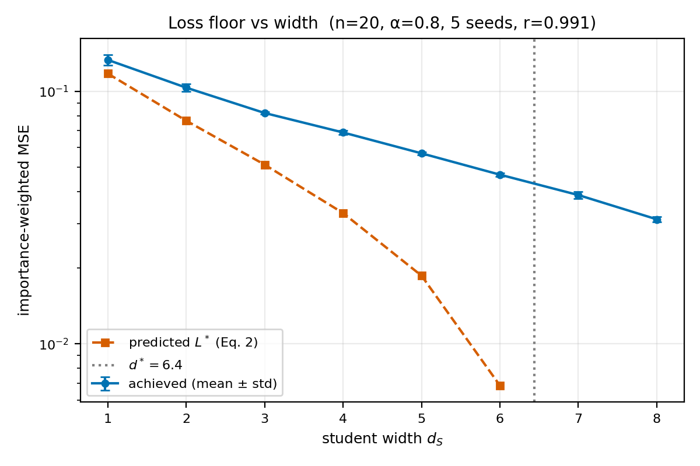

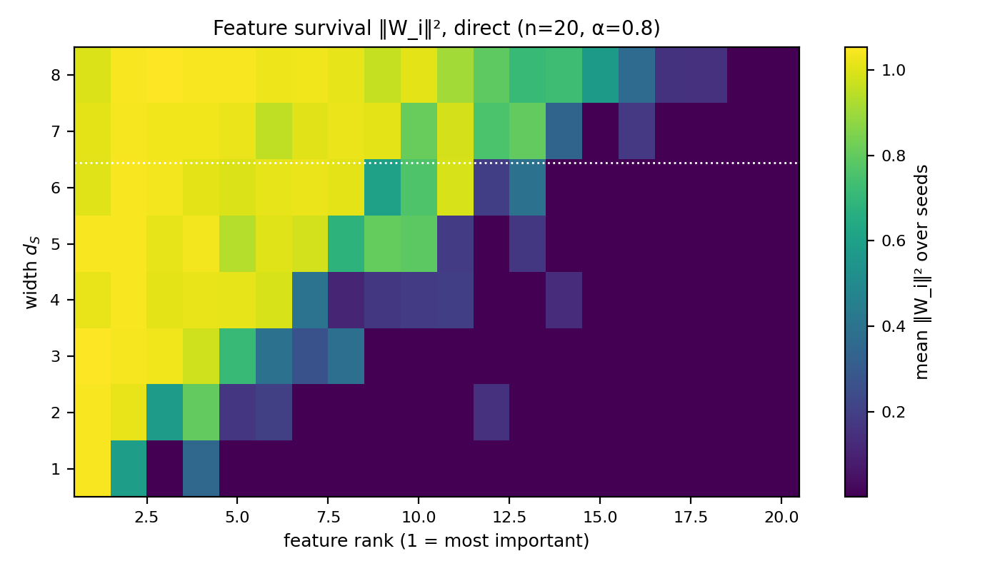

### n=20, α=0.9 (d*=4.61, 5 seeds, 10000 steps)

Pearson r (predicted vs achieved): **0.9857**

| d_S | predicted L* | achieved (mean ± std) | survived F̂ | F_kept=⌊d·g⌋ |
|----:|-------------:|----------------------:|-----------:|------------:|
| 1 | 5.0480e-02 | 7.0245e-02 ± 4.4e-03 | 2.0 | 4 |
| 2 | 2.9329e-02 | 5.3234e-02 ± 1.4e-03 | 4.0 | 8 |
| 3 | 1.3920e-02 | 3.9504e-02 ± 5.2e-04 | 6.0 | 13 |
| 4 | 5.2729e-03 | 3.1738e-02 ± 5.4e-04 | 8.8 | 17 |
| 5 | 0.0000e+00 | 2.5299e-02 ± 3.3e-04 | 11.4 | 20 |
| 6 | 0.0000e+00 | 2.0659e-02 ± 4.2e-04 | 13.6 | 20 |

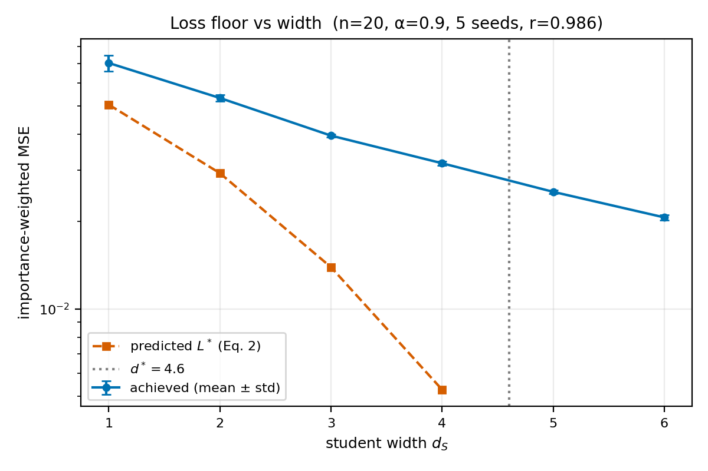

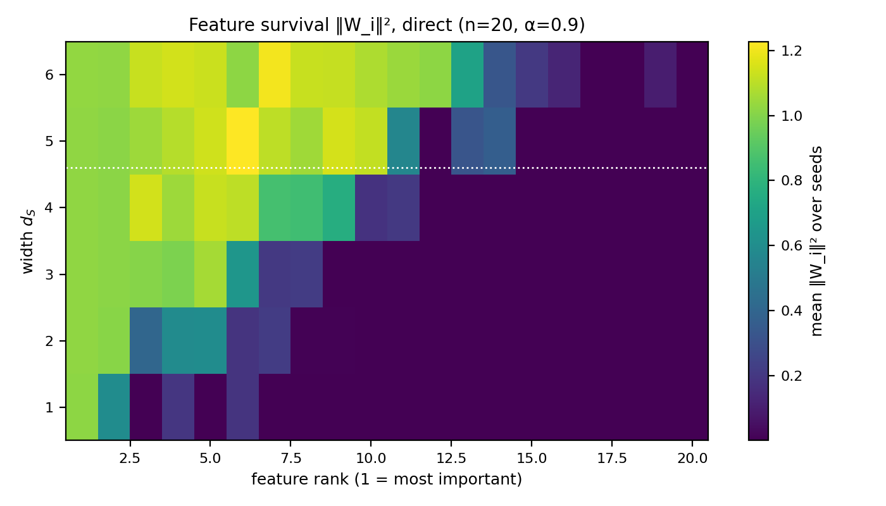

### n=20, α=0.95 (d*=3.00, 5 seeds, 10000 steps)

Pearson r (predicted vs achieved): **0.9684**

| d_S | predicted L* | achieved (mean ± std) | survived F̂ | F_kept=⌊d·g⌋ |
|----:|-------------:|----------------------:|-----------:|------------:|
| 1 | 1.9129e-02 | 3.4949e-02 ± 1.6e-03 | 2.0 | 6 |
| 2 | 6.9601e-03 | 2.5311e-02 ± 9.5e-04 | 4.6 | 13 |
| 3 | 0.0000e+00 | 1.8752e-02 ± 3.5e-04 | 7.4 | 20 |
| 4 | 0.0000e+00 | 1.4683e-02 ± 2.0e-04 | 10.4 | 20 |

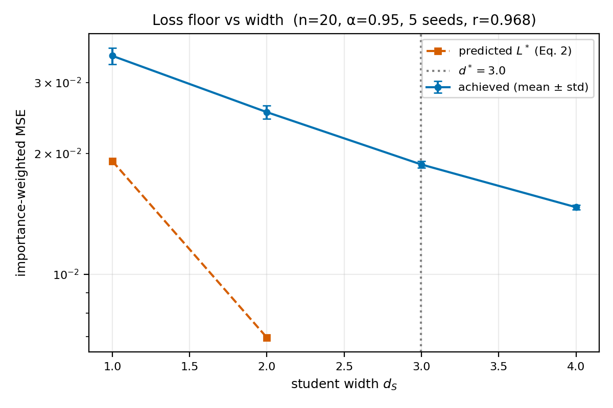

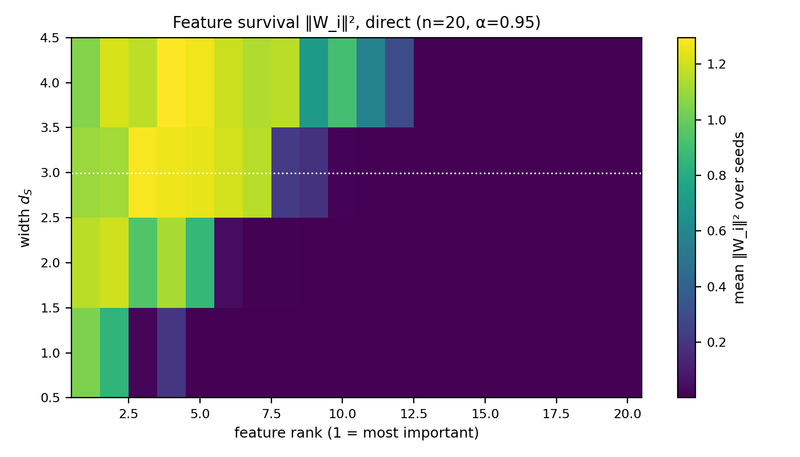

### n=20, α=0.99 (d*=0.92, 5 seeds, 10000 steps)

> **Degenerate config:** d* < 1, so the predicted floor is identically 0 at every trained width and Pearson r is undefined (excluded from the headline mean).

Pearson r (predicted vs achieved): **n/a**

| d_S | predicted L* | achieved (mean ± std) | survived F̂ | F_kept=⌊d·g⌋ |
|----:|-------------:|----------------------:|-----------:|------------:|
| 1 | 0.0000e+00 | 6.8612e-03 ± 2.9e-04 | 2.0 | 20 |
| 2 | 0.0000e+00 | 4.8383e-03 ± 2.5e-04 | 5.0 | 20 |

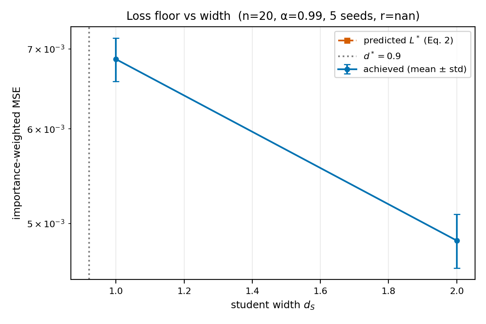

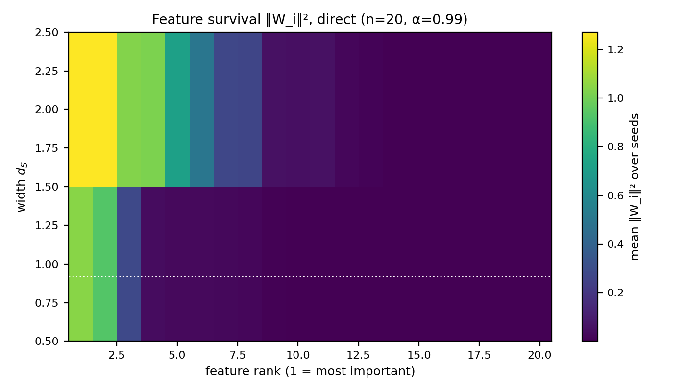

### n=40, α=0.8 (d*=12.88, 5 seeds, 10000 steps)

Pearson r (predicted vs achieved): **0.9967**

| d_S | predicted L* | achieved (mean ± std) | survived F̂ | F_kept=⌊d·g⌋ |
|----:|-------------:|----------------------:|-----------:|------------:|
| 1 | 1.6301e-01 | 1.7247e-01 ± 7.7e-03 | 1.8 | 3 |
| 2 | 1.2190e-01 | 1.4333e-01 ± 6.3e-03 | 4.0 | 6 |
| 3 | 9.6638e-02 | 1.1995e-01 ± 8.9e-04 | 6.0 | 9 |
| 4 | 7.8355e-02 | 1.0647e-01 ± 7.3e-04 | 7.6 | 12 |
| 5 | 6.4021e-02 | 9.5648e-02 ± 1.5e-03 | 9.4 | 15 |
| 6 | 5.2229e-02 | 8.5605e-02 ± 1.1e-03 | 11.2 | 18 |
| 7 | 4.2212e-02 | 7.6878e-02 ± 9.9e-04 | 12.8 | 21 |
| 8 | 3.3506e-02 | 7.0241e-02 ± 4.3e-04 | 14.4 | 24 |
| 9 | 2.5806e-02 | 6.4153e-02 ± 3.7e-04 | 16.0 | 27 |
| 10 | 1.6753e-02 | 5.7846e-02 ± 4.8e-04 | 18.2 | 31 |
| 11 | 1.0689e-02 | 5.2956e-02 ± 4.9e-04 | 20.8 | 34 |
| 12 | 5.1305e-03 | 4.7829e-02 ± 2.8e-04 | 22.0 | 37 |
| 13 | 0.0000e+00 | 4.4114e-02 ± 8.0e-04 | 23.4 | 40 |
| 14 | 0.0000e+00 | 3.9493e-02 ± 2.9e-04 | 25.0 | 40 |

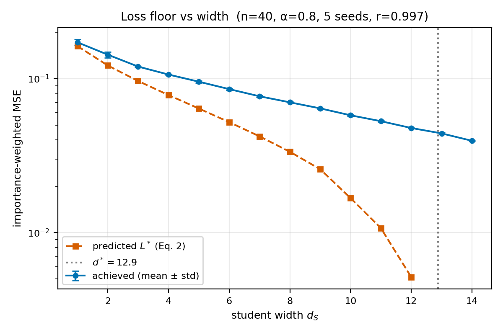

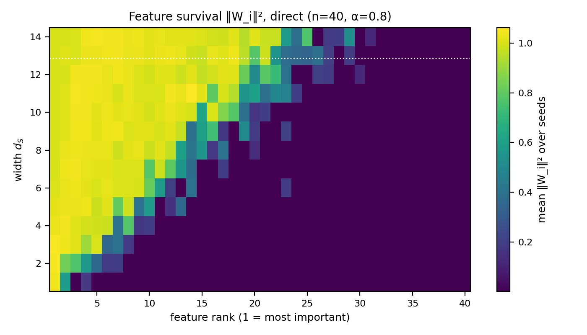

### n=40, α=0.9 (d*=9.21, 5 seeds, 10000 steps)

Pearson r (predicted vs achieved): **0.9953**

| d_S | predicted L* | achieved (mean ± std) | survived F̂ | F_kept=⌊d·g⌋ |
|----:|-------------:|----------------------:|-----------:|------------:|
| 1 | 7.3174e-02 | 9.1485e-02 ± 3.4e-03 | 2.0 | 4 |
| 2 | 5.2023e-02 | 7.1680e-02 ± 1.5e-03 | 4.0 | 8 |
| 3 | 3.6614e-02 | 6.0445e-02 ± 3.4e-04 | 6.8 | 13 |
| 4 | 2.7966e-02 | 5.2833e-02 ± 6.3e-04 | 9.2 | 17 |
| 5 | 2.1106e-02 | 4.6161e-02 ± 7.8e-05 | 11.6 | 21 |
| 6 | 1.4137e-02 | 4.1181e-02 ± 5.8e-04 | 13.8 | 26 |
| 7 | 9.4519e-03 | 3.6936e-02 ± 3.6e-04 | 15.6 | 30 |
| 8 | 5.3444e-03 | 3.2784e-02 ± 3.3e-04 | 18.4 | 34 |
| 9 | 8.3333e-04 | 2.9296e-02 ± 3.4e-04 | 20.4 | 39 |
| 10 | 0.0000e+00 | 2.6142e-02 ± 1.4e-04 | 22.4 | 40 |
| 11 | 0.0000e+00 | 2.3321e-02 ± 1.9e-04 | 25.0 | 40 |

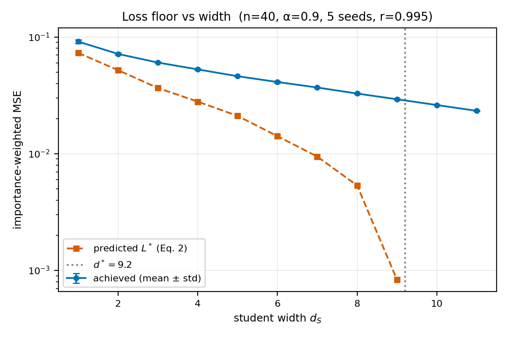

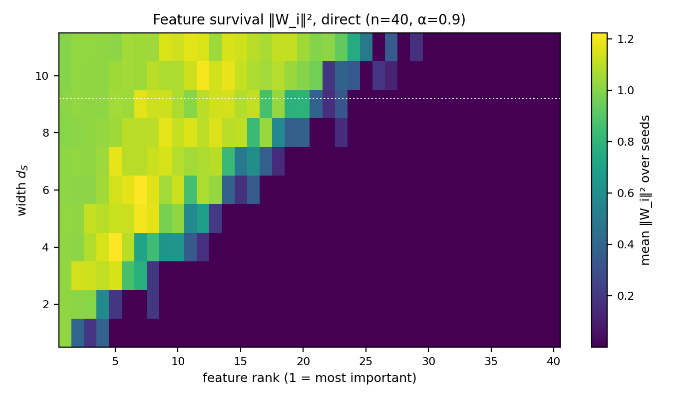

### n=40, α=0.95 (d*=5.99, 5 seeds, 10000 steps)

Pearson r (predicted vs achieved): **0.9926**

| d_S | predicted L* | achieved (mean ± std) | survived F̂ | F_kept=⌊d·g⌋ |
|----:|-------------:|----------------------:|-----------:|------------:|
| 1 | 3.0476e-02 | 4.5530e-02 ± 1.6e-03 | 2.0 | 6 |
| 2 | 1.8307e-02 | 3.5843e-02 ± 3.7e-04 | 4.6 | 13 |
| 3 | 1.1347e-02 | 2.9685e-02 ± 1.9e-04 | 7.6 | 20 |
| 4 | 7.0687e-03 | 2.5192e-02 ± 2.1e-04 | 10.8 | 26 |
| 5 | 3.1624e-03 | 2.1746e-02 ± 2.5e-04 | 13.4 | 33 |
| 6 | 0.0000e+00 | 1.8673e-02 ± 2.3e-04 | 16.6 | 40 |
| 7 | 0.0000e+00 | 1.6344e-02 ± 2.5e-04 | 19.8 | 40 |

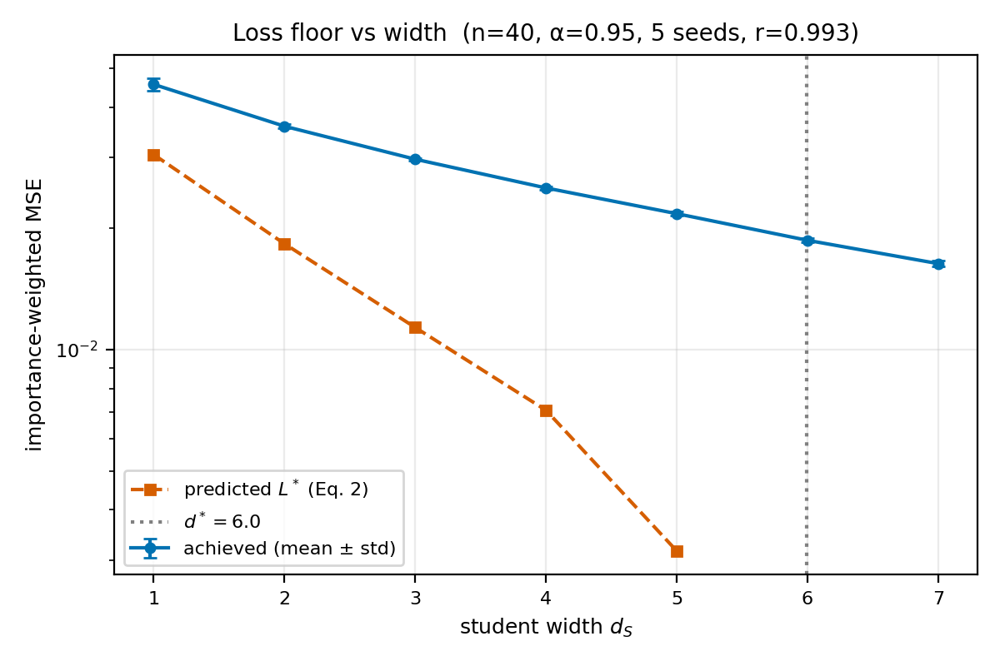

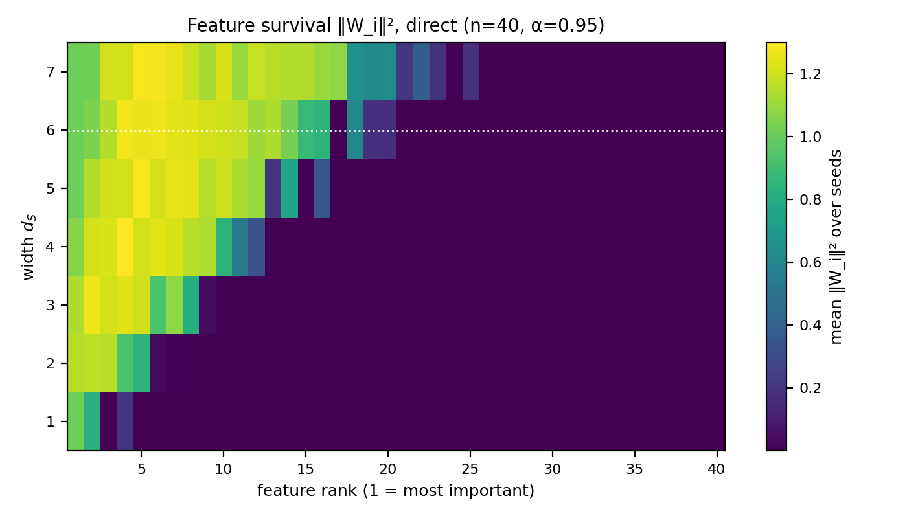

### n=40, α=0.99 (d*=1.84, 5 seeds, 10000 steps)

Pearson r (predicted vs achieved): **0.9201**

| d_S | predicted L* | achieved (mean ± std) | survived F̂ | F_kept=⌊d·g⌋ |
|----:|-------------:|----------------------:|-----------:|------------:|
| 1 | 2.1106e-03 | 9.5390e-03 ± 4.6e-04 | 2.0 | 21 |
| 2 | 0.0000e+00 | 6.9994e-03 ± 1.0e-04 | 5.0 | 40 |
| 3 | 0.0000e+00 | 5.5343e-03 ± 4.9e-05 | 9.8 | 40 |

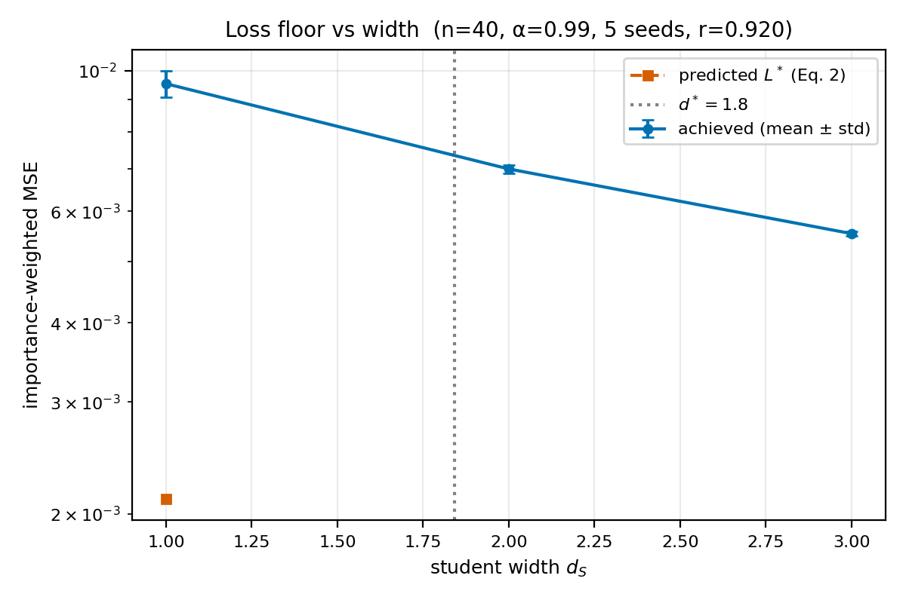

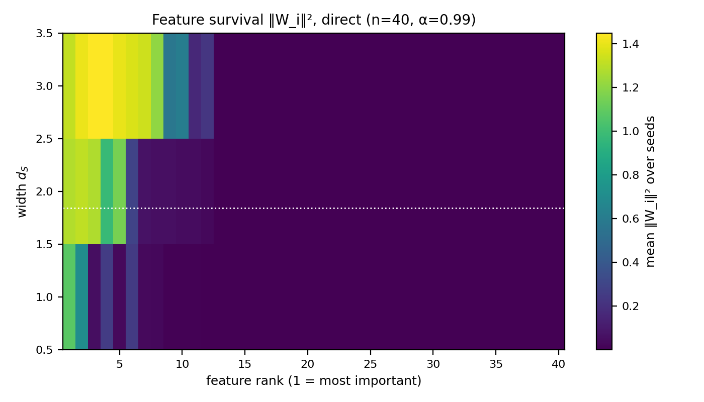

### n=80, α=0.8 (d*=25.75, 5 seeds, 10000 steps)

Pearson r (predicted vs achieved): **0.9991**

| d_S | predicted L* | achieved (mean ± std) | survived F̂ | F_kept=⌊d·g⌋ |
|----:|-------------:|----------------------:|-----------:|------------:|
| 1 | 2.0881e-01 | 2.0774e-01 ± 3.2e-03 | 2.0 | 3 |
| 2 | 1.6770e-01 | 1.7956e-01 ± 1.6e-03 | 4.0 | 6 |
| 3 | 1.4243e-01 | 1.6156e-01 ± 3.7e-03 | 5.4 | 9 |
| 4 | 1.2415e-01 | 1.4648e-01 ± 6.2e-04 | 7.6 | 12 |
| 5 | 1.0982e-01 | 1.3408e-01 ± 1.3e-03 | 9.0 | 15 |
| 6 | 9.8025e-02 | 1.2450e-01 ± 4.4e-04 | 10.6 | 18 |
| 7 | 8.8008e-02 | 1.1612e-01 ± 7.9e-04 | 12.8 | 21 |
| 8 | 7.9301e-02 | 1.0976e-01 ± 1.9e-03 | 14.6 | 24 |
| 9 | 7.1602e-02 | 1.0354e-01 ± 2.0e-03 | 16.4 | 27 |
| 10 | 6.2549e-02 | 9.6815e-02 ± 2.6e-04 | 17.8 | 31 |
| 11 | 5.6485e-02 | 9.2223e-02 ± 5.4e-04 | 19.2 | 34 |
| 12 | 5.0926e-02 | 8.7281e-02 ± 2.5e-04 | 20.8 | 37 |
| 13 | 4.5796e-02 | 8.2521e-02 ± 6.0e-04 | 23.4 | 40 |
| 14 | 4.1032e-02 | 7.8897e-02 ± 2.8e-04 | 24.4 | 43 |
| 15 | 3.6586e-02 | 7.5205e-02 ± 5.7e-04 | 26.2 | 46 |
| 16 | 3.2418e-02 | 7.1530e-02 ± 4.4e-04 | 28.0 | 49 |
| 17 | 2.8496e-02 | 6.8329e-02 ± 6.6e-04 | 29.8 | 52 |
| 18 | 2.4791e-02 | 6.4916e-02 ± 2.5e-04 | 31.4 | 55 |
| 19 | 2.0152e-02 | 6.1975e-02 ± 1.7e-04 | 33.0 | 59 |
| 20 | 1.6872e-02 | 5.9043e-02 ± 3.2e-04 | 34.4 | 62 |
| 21 | 1.3747e-02 | 5.6307e-02 ± 2.3e-04 | 36.4 | 65 |
| 22 | 1.0761e-02 | 5.3729e-02 ± 4.2e-04 | 38.2 | 68 |
| 23 | 7.9039e-03 | 5.1115e-02 ± 1.5e-04 | 40.0 | 71 |
| 24 | 5.1638e-03 | 4.8965e-02 ± 2.4e-04 | 41.4 | 74 |
| 25 | 2.5319e-03 | 4.6647e-02 ± 2.4e-04 | 43.0 | 77 |
| 26 | 0.0000e+00 | 4.4548e-02 ± 3.7e-04 | 45.6 | 80 |
| 27 | 0.0000e+00 | 4.2487e-02 ± 2.0e-04 | 46.4 | 80 |

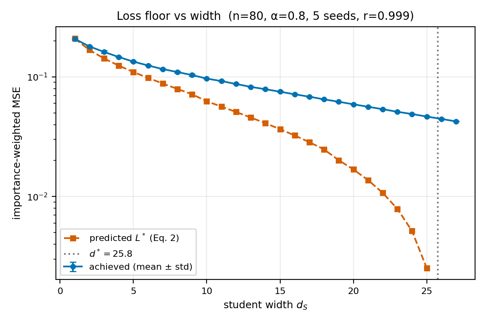

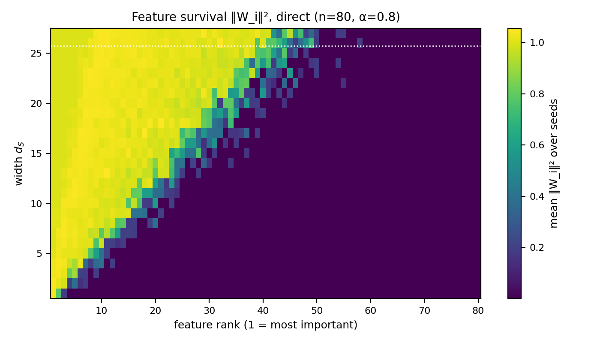

### n=80, α=0.9 (d*=18.42, 5 seeds, 10000 steps)

Pearson r (predicted vs achieved): **0.9989**

| d_S | predicted L* | achieved (mean ± std) | survived F̂ | F_kept=⌊d·g⌋ |
|----:|-------------:|----------------------:|-----------:|------------:|
| 1 | 9.6072e-02 | 1.1192e-01 ± 2.5e-03 | 2.0 | 4 |
| 2 | 7.4921e-02 | 9.3303e-02 ± 1.3e-03 | 4.0 | 8 |
| 3 | 5.9512e-02 | 8.1133e-02 ± 1.2e-04 | 6.2 | 13 |
| 4 | 5.0864e-02 | 7.4124e-02 ± 4.2e-04 | 8.8 | 17 |
| 5 | 4.4004e-02 | 6.7576e-02 ± 2.9e-04 | 11.0 | 21 |
| 6 | 3.7035e-02 | 6.2553e-02 ± 6.3e-04 | 13.8 | 26 |
| 7 | 3.2350e-02 | 5.7876e-02 ± 4.2e-04 | 16.4 | 30 |
| 8 | 2.8242e-02 | 5.3980e-02 ± 2.6e-04 | 18.6 | 34 |
| 9 | 2.3731e-02 | 5.0482e-02 ± 2.8e-04 | 20.2 | 39 |
| 10 | 2.0516e-02 | 4.7439e-02 ± 4.4e-04 | 23.4 | 43 |
| 11 | 1.7584e-02 | 4.4698e-02 ± 3.2e-04 | 24.6 | 47 |
| 12 | 1.4248e-02 | 4.1846e-02 ± 2.1e-04 | 27.6 | 52 |
| 13 | 1.1800e-02 | 3.9536e-02 ± 1.9e-04 | 29.6 | 56 |
| 14 | 9.5203e-03 | 3.7386e-02 ± 1.8e-04 | 32.2 | 60 |
| 15 | 6.8735e-03 | 3.5007e-02 ± 1.9e-04 | 34.0 | 65 |
| 16 | 4.8976e-03 | 3.3228e-02 ± 4.5e-04 | 37.4 | 69 |
| 17 | 3.0323e-03 | 3.1360e-02 ± 1.4e-04 | 39.2 | 73 |
| 18 | 8.3861e-04 | 2.9772e-02 ± 1.6e-04 | 42.0 | 78 |
| 19 | 0.0000e+00 | 2.7920e-02 ± 1.5e-04 | 42.8 | 80 |
| 20 | 0.0000e+00 | 2.6527e-02 ± 1.9e-04 | 45.4 | 80 |

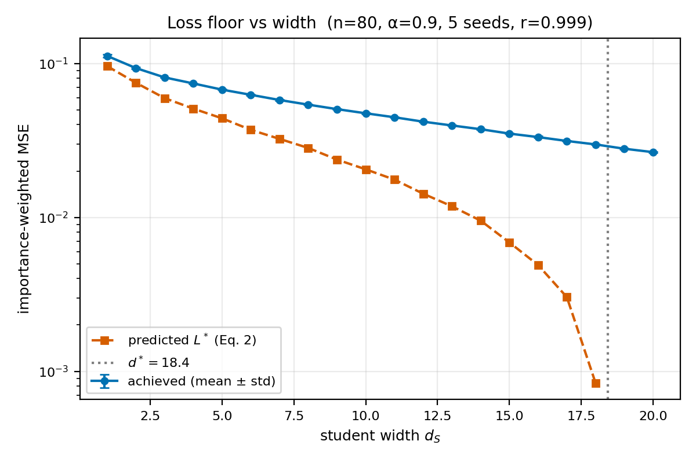

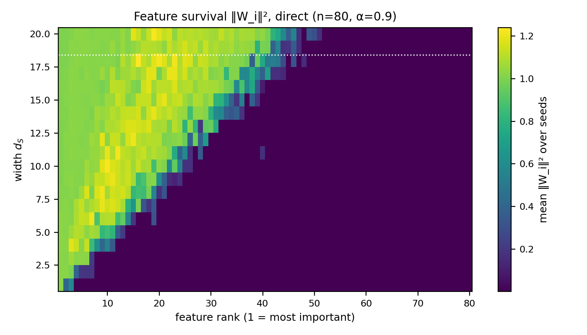

### n=80, α=0.95 (d*=11.98, 5 seeds, 10000 steps)

Pearson r (predicted vs achieved): **0.9963**

| d_S | predicted L* | achieved (mean ± std) | survived F̂ | F_kept=⌊d·g⌋ |
|----:|-------------:|----------------------:|-----------:|------------:|
| 1 | 4.1925e-02 | 5.6334e-02 ± 1.1e-03 | 2.0 | 6 |
| 2 | 2.9756e-02 | 4.7958e-02 ± 1.5e-03 | 4.6 | 13 |
| 3 | 2.2796e-02 | 4.1588e-02 ± 5.3e-04 | 7.2 | 20 |
| 4 | 1.8518e-02 | 3.6184e-02 ± 2.1e-04 | 10.6 | 26 |
| 5 | 1.4611e-02 | 3.2770e-02 ± 1.1e-04 | 13.8 | 33 |
| 6 | 1.1449e-02 | 2.9686e-02 ± 1.2e-04 | 16.6 | 40 |
| 7 | 9.1465e-03 | 2.7293e-02 ± 2.2e-04 | 19.4 | 46 |
| 8 | 6.8095e-03 | 2.4987e-02 ± 1.3e-04 | 23.0 | 53 |
| 9 | 4.7601e-03 | 2.3233e-02 ± 1.1e-04 | 26.0 | 60 |
| 10 | 3.1842e-03 | 2.1544e-02 ± 3.3e-04 | 30.2 | 66 |
| 11 | 1.5162e-03 | 1.9955e-02 ± 2.3e-04 | 33.2 | 73 |
| 12 | 0.0000e+00 | 1.8637e-02 ± 2.2e-04 | 35.6 | 80 |
| 13 | 0.0000e+00 | 1.7493e-02 ± 1.5e-04 | 38.2 | 80 |

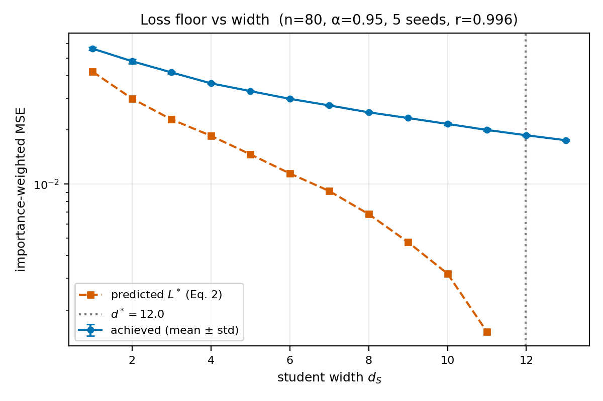

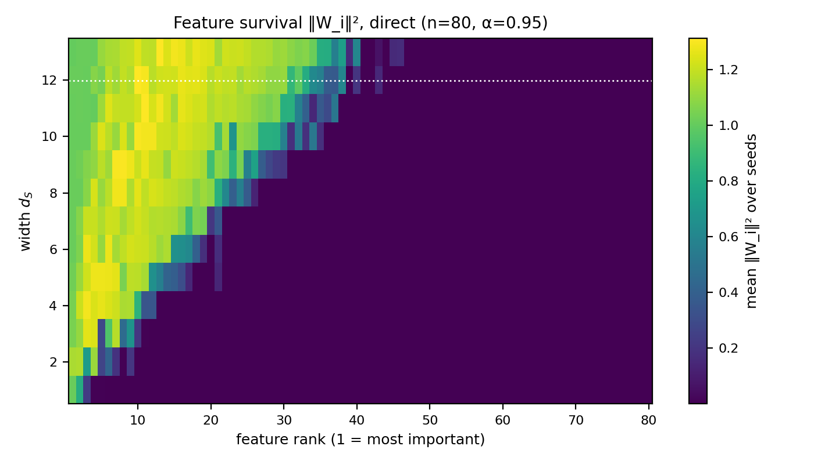

### n=80, α=0.99 (d*=3.68, 5 seeds, 10000 steps)

Pearson r (predicted vs achieved): **0.9765**

| d_S | predicted L* | achieved (mean ± std) | survived F̂ | F_kept=⌊d·g⌋ |
|----:|-------------:|----------------------:|-----------:|------------:|
| 1 | 4.4004e-03 | 1.1695e-02 ± 3.2e-04 | 2.0 | 21 |
| 2 | 2.0516e-03 | 9.2969e-03 ± 1.0e-04 | 5.0 | 43 |
| 3 | 6.8735e-04 | 7.8074e-03 ± 3.2e-05 | 9.2 | 65 |
| 4 | 0.0000e+00 | 6.7435e-03 ± 5.1e-05 | 13.8 | 80 |
| 5 | 0.0000e+00 | 5.7989e-03 ± 3.0e-05 | 20.6 | 80 |

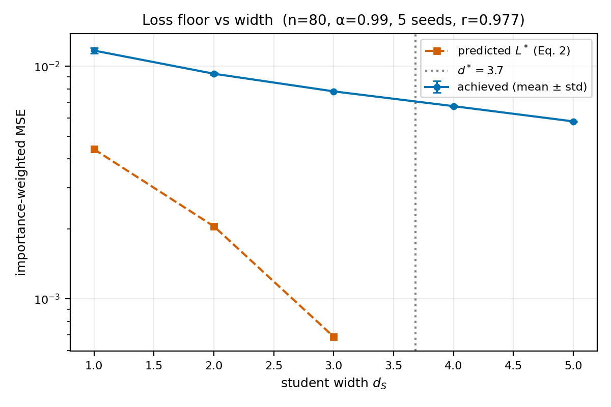

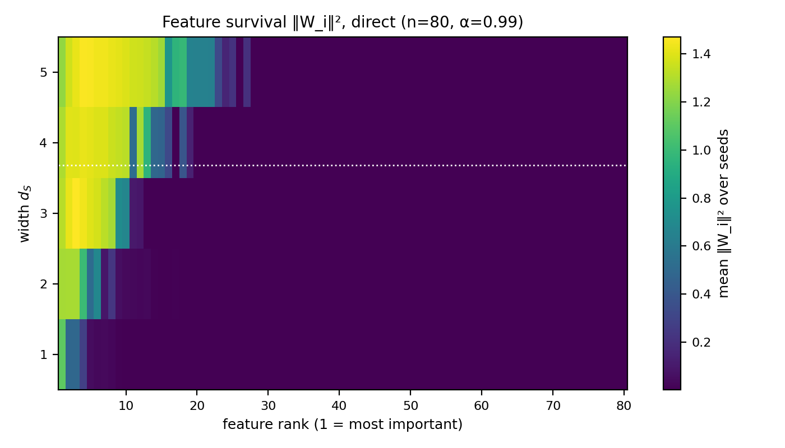

**Headline:** mean Pearson r across 11 config(s): **0.9837** (success criterion > 0.9) (1 degenerate config(s) excluded).

## Absolute-floor predictors — equilibrium correction

Predictors of the **absolute** floor on all 600 (config × width × seed) points: (a) original Eq. 2 F=⌊d·g⌋; (b) equilibrium count F=round(d·ĝ), ĝ=1.03·g(α)^0.53 (also with floor() to quantify the rounding convention); **(b′) the zero-fitted-parameter audit** — Eq. 2 charged on each run's own measured kept set S_obs; (c) per-feature Σᵢ Iᵢ·E[xᵢ²]·(1−Cᵢ) with measured Cᵢ.

Strata are d/d* bands fixed in config: below = d/d* < 0.8, near = 0.8 <= d/d* <= 1.2, above = d/d* > 1.2. The above-d* stratum has few independent (config, width) cells (~6, at 5 seeds each), so its numbers are indicative rather than load-bearing.

**R² (MAE) on absolute floors** (negative R² = worse than predicting the mean):

| stratum | n | (a) Eq. 2 | (b) equilibrium | (b) w/ floor() | (b′) measured kept set | (c) per-feature |
|---|--:|--:|--:|--:|--:|--:|
| overall | 600 | 0.515 (0.0255) | 0.968 (0.0061) | 0.933 (0.0067) | 0.973 (0.0050) | -0.525 (0.0445) |
| below | 385 | 0.571 (0.0251) | 0.974 (0.0055) | 0.918 (0.0067) | 0.973 (0.0048) | -0.651 (0.0479) |
| near | 185 | -3.756 (0.0284) | 0.673 (0.0075) | 0.720 (0.0069) | 0.795 (0.0058) | -8.588 (0.0405) |
| above | 30 | -2.026 (0.0138) | 0.491 (0.0057) | 0.564 (0.0052) | 0.635 (0.0042) | -10.243 (0.0245) |

Per-config aggregated R² (12 units, mean / median): (a) Eq. 2 -5.43 / -1.17; (b) equilibrium -0.04 / 0.83; (b) w/ floor() 0.08 / 0.84; (b′) measured kept set 0.91 / 0.91; (c) per-feature -4.70 / -4.61.

**Reading.** Pooled, Eq. 2 (a) looks adequate below d* (R² = 0.57) and collapses near/above (R² = -3.76 / -2.03); per-config its median R² is -1.17 — the pooled number is held up by cross-config variance. The one-fitted-law equilibrium count (b) lifts the strata to 0.67 / 0.49, but per-config it is uneven (mean -0.04 / median 0.83): the negative mean is driven by the three α=0.99 configs, where floors are tiny and a ±1-feature count error explodes R² — (b′) stays ≥ 0.85 on those same configs. The rounding convention is worth ±0.03–0.07 R² near d* (see the floor() column). The zero-parameter (b′) is the best predictor in every stratum (0.97 overall; per-config mean 0.91): once the kept set is known, Eq. 2's charging is essentially correct — the entire failure of (a) is in predicting the kept COUNT, not the per-feature cost. Predictor (c) overshoots (R² = -0.53): fractional capacity does not map linearly to loss.

### Gap decomposition — where the loss lives

Per run, achieved floor = Σ_{i∉S} Iᵢ·mseᵢ (dropped importance) + Σ_{i∈S} Iᵢ·mseᵢ (kept-feature residual = interference):

| stratum | dropped share | kept-residual share | measured dropped cost / Eq. 2 charge |
|---|--:|--:|--:|
| overall | 0.82 | 0.18 | 0.90 |
| below | 0.87 | 0.13 | 0.90 |
| near | 0.73 | 0.27 | 0.91 |
| above | 0.72 | 0.28 | 0.94 |

Dropped importance carries most of the floor everywhere; the kept-feature interference residual grows toward d* but stays the minority share. The measured per-dropped-feature cost is ≈0.9× the Eq. 2 charge E[x²] (slightly below 1: a bias-optimal constant recovers Var(x) < E[x²]). This also makes (b′)'s residual near d* predictable: it overcharges dropped features by ~1/0.9 and omits the ~27% interference share, netting ~20% under-prediction — "charging essentially correct" holds to first order.

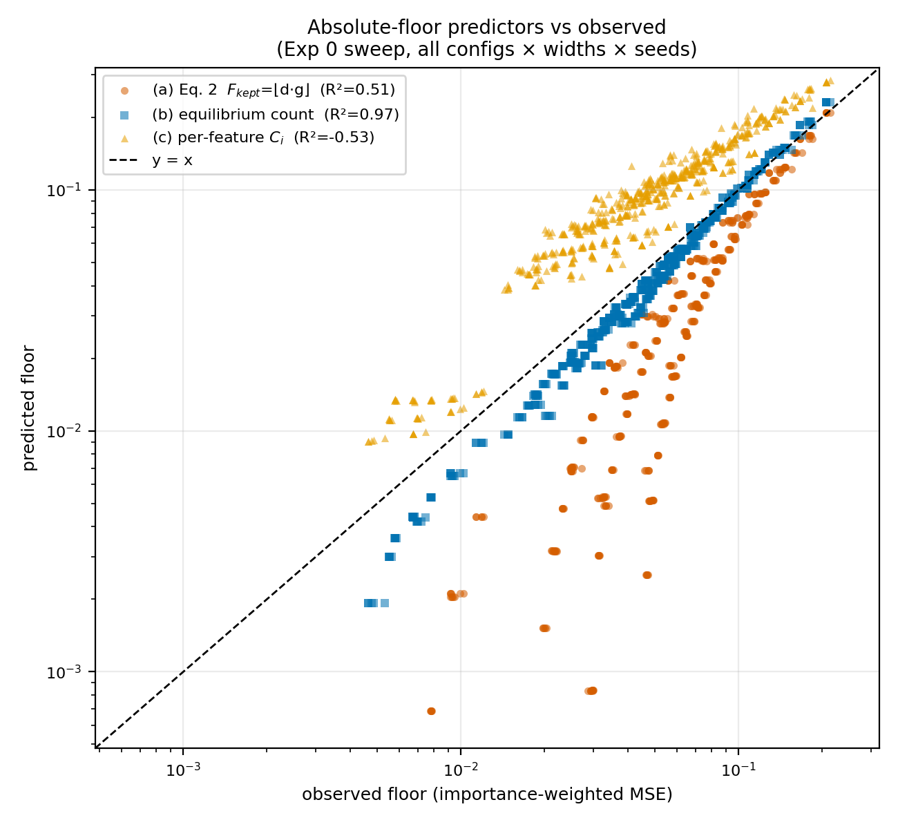

### d_S = d_T geometric/residual split

Their Pythia baseline B is read at d_S = d_T assuming the geometric term ≈ 0. Geometric estimates: (b′) measured kept set (preferred, zero parameters), (b) fitted law, (c) loose upper bound:

| config | d_T | L_obs | gfrac (b′) | gfrac (b) | gfrac (c) |
|---|--:|--:|--:|--:|--:|
| n20_a0.80 | 8 | 0.0311 | 0.65 | 0.60 | 2.89 |
| n20_a0.90 | 6 | 0.0207 | 0.61 | 0.56 | 3.23 |
| n20_a0.95 | 4 | 0.0147 | 0.73 | 0.66 | 2.67 |
| n20_a0.99 | 2 | 0.0048 | 0.96 | 0.40 | 1.88 |
| n40_a0.80 | 14 | 0.0395 | 0.80 | 0.72 | 2.38 |
| n40_a0.90 | 11 | 0.0233 | 0.66 | 0.66 | 2.81 |
| n40_a0.95 | 7 | 0.0163 | 0.71 | 0.69 | 2.84 |
| n40_a0.99 | 3 | 0.0055 | 0.83 | 0.54 | 2.01 |
| n80_a0.80 | 27 | 0.0425 | 0.85 | 0.70 | 2.17 |
| n80_a0.90 | 20 | 0.0265 | 0.71 | 0.72 | 2.54 |
| n80_a0.95 | 13 | 0.0175 | 0.70 | 0.73 | 2.55 |
| n80_a0.99 | 5 | 0.0058 | 0.78 | 0.62 | 2.32 |

Geometric fraction at d_S = d_T via (b′): **0.61–0.96** (mean 0.75).

Geometric fraction at d_S = d_T via (b): **0.40–0.73** (mean 0.63).

A substantial geometric share means the architectural baseline B is contaminated by superposition cost, not a pure width-independent residual.

## Exp A — Allocation audit of vanilla distillation

### n=40, α=0.9, teacher d_T=10 (d*=9.21, 5 seeds)

Teacher keeps |S_T| = 22.0 ± 0.0 of 40 features (loss 0.0262).

| d_S | overlap@k distill | overlap@k direct | |S| distill | |S| direct | F_kept | in-teacher (distill) |
|----:|------------------:|-----------------:|------------:|-----------:|-------:|---------------------:|
| 1 | 0.900 ± 0.200 | 0.700 ± 0.245 | 2.0 | 2.0 | 4 | 1.000 |
| 2 | 0.800 ± 0.100 | 0.900 ± 0.122 | 4.0 | 4.2 | 8 | 1.000 |
| 3 | 0.914 ± 0.070 | 1.000 ± 0.000 | 7.0 | 6.2 | 13 | 1.000 |
| 4 | 0.933 ± 0.055 | 0.956 ± 0.054 | 8.8 | 8.6 | 17 | 1.000 |
| 5 | 0.897 ± 0.062 | 0.911 ± 0.003 | 11.6 | 11.2 | 21 | 1.000 |
| 6 | 0.931 ± 0.005 | 0.956 ± 0.036 | 14.6 | 13.6 | 26 | 1.000 |
| 7 | 0.963 ± 0.030 | 0.964 ± 0.047 | 16.4 | 15.6 | 30 | 1.000 |
| 8 | 0.969 ± 0.025 | 0.989 ± 0.021 | 19.2 | 18.2 | 34 | 1.000 |
| 9 | 0.972 ± 0.023 | 0.969 ± 0.025 | 20.8 | 19.8 | 39 | 1.000 |
| 10 | 0.955 ± 0.029 | 0.956 ± 0.029 | 22.0 | 23.0 | 40 | 1.000 |

**A2 ordering:** min overlap@k under distillation = **0.800** at d_S = 2. Teacher containment is 1.000 at every width — distilled students keep only features their teacher represents.

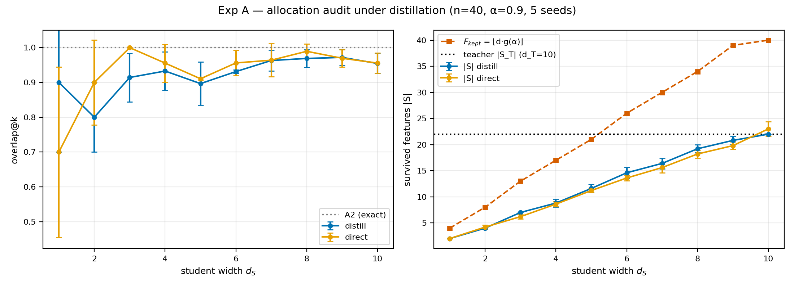

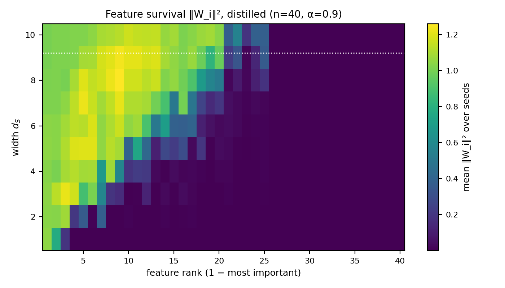

## Exp B — Controlled feature placement

### n=40, α=0.9, d_T=10, C = ranks [20, 28, 36] (d*=9.21, 5 seeds)

Teacher (d_T=10) represents 0.33 of C on average — distilled students can only keep teacher-carried features (Exp A containment); the 'task' target is the placement-only control.

#### target: teacher

| d_S | β | C-survival (ach / Eq.2) | ΔL floor cost (ach / Eq.2) | evicted |
|----:|--:|------------------------:|------------------------------:|--------:|
| 3 | 1 | 0.00 / 0.00 | 0.0000 / 0.0000 | 0.0 |
| 3 | 3 | 0.07 / 0.67 | 0.0012 / 0.0025 | 1.0 |
| 3 | 10 | 0.33 / 1.00 | 0.0040 / 0.0046 | 1.2 |
| 3 | 30 | 0.33 / 1.00 | 0.0051 / 0.0046 | 2.0 |
| 3 | 100 | 0.33 / 1.00 | 0.0076 / 0.0046 | 2.4 |
| 5 | 1 | 0.00 / 0.33 | 0.0000 / 0.0000 | 0.0 |
| 5 | 3 | 0.33 / 1.00 | 0.0009 / 0.0012 | 1.6 |
| 5 | 10 | 0.33 / 1.00 | 0.0019 / 0.0012 | 1.8 |
| 5 | 30 | 0.33 / 1.00 | 0.0017 / 0.0012 | 2.0 |
| 5 | 100 | 0.33 / 1.00 | 0.0026 / 0.0012 | 2.6 |
| 7 | 1 | 0.07 / 0.67 | 0.0000 / 0.0000 | 0.0 |
| 7 | 3 | 0.33 / 1.00 | 0.0003 / 0.0002 | 0.8 |
| 7 | 10 | 0.33 / 1.00 | 0.0009 / 0.0002 | 0.8 |
| 7 | 30 | 0.33 / 1.00 | 0.0007 / 0.0002 | 2.0 |
| 7 | 100 | 0.33 / 1.00 | 0.0010 / 0.0002 | 1.6 |

#### target: task

| d_S | β | C-survival (ach / Eq.2) | ΔL floor cost (ach / Eq.2) | evicted |
|----:|--:|------------------------:|------------------------------:|--------:|
| 3 | 1 | 0.00 / 0.00 | 0.0000 / 0.0000 | 0.0 |
| 3 | 3 | 0.07 / 0.67 | 0.0008 / 0.0025 | 1.0 |
| 3 | 10 | 0.93 / 1.00 | 0.0101 / 0.0046 | 2.4 |
| 3 | 30 | 1.00 / 1.00 | 0.0157 / 0.0046 | 3.4 |
| 3 | 100 | 1.00 / 1.00 | 0.0162 / 0.0046 | 3.4 |
| 5 | 1 | 0.00 / 0.33 | 0.0000 / 0.0000 | 0.0 |
| 5 | 3 | 0.73 / 1.00 | 0.0022 / 0.0012 | 1.8 |
| 5 | 10 | 1.00 / 1.00 | 0.0058 / 0.0012 | 3.6 |
| 5 | 30 | 1.00 / 1.00 | 0.0069 / 0.0012 | 3.8 |
| 5 | 100 | 1.00 / 1.00 | 0.0140 / 0.0012 | 5.4 |
| 7 | 1 | 0.00 / 0.67 | 0.0000 / 0.0000 | 0.0 |
| 7 | 3 | 1.00 / 1.00 | 0.0024 / 0.0002 | 2.4 |
| 7 | 10 | 1.00 / 1.00 | 0.0037 / 0.0002 | 4.0 |
| 7 | 30 | 1.00 / 1.00 | 0.0053 / 0.0002 | 5.4 |
| 7 | 100 | 1.00 / 1.00 | 0.0109 / 0.0002 | 7.2 |

**≥90% C-survival [teacher]:** not reached at any β.
**≥90% C-survival [task]:** d_S=3: β=10; d_S=5: β=10; d_S=7: β=3.

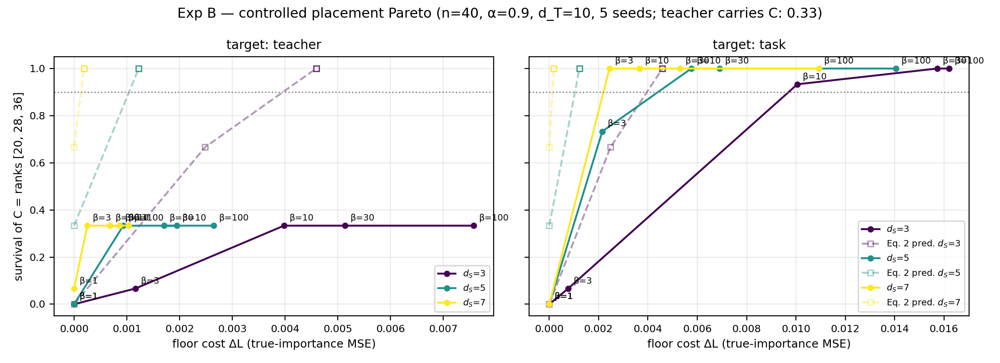

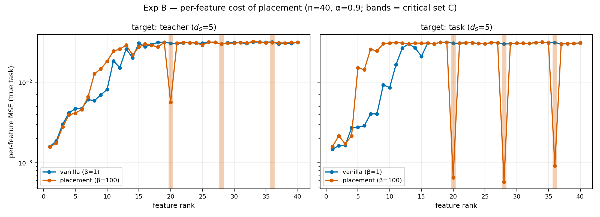

## Exp C — Correlation-aware packing (blocked data)

### n=40, α=0.9, groups of 4 consecutive ranks (d*=9.21, 5 seeds)

Per-feature marginals are identical to iid, so Eq. 2's L* is unchanged; differences are pure correlation effects.

At d_S = 6 (mean over seeds; L* = 0.0141):

| setting | floor | survived |S| | ΣC_i | within-group |cos| | cross-group |cos| |
|---|---:|---:|---:|---:|---:|
| iid | 0.0413 | 13.0 | 6.00 | 0.189 | 0.117 |
| blocked | 0.0355 | 15.2 | 5.99 | 0.435 | 0.143 |
| blocked λ=0.03 | 0.0372 | 12.8 | 6.00 | 0.376 | 0.049 |
| blocked λ=0.3 | 0.0467 | 11.4 | 6.00 | 0.670 | 0.000 |

**Claim (a)** (emergent superposition exploits anti-correlation): blocked floor < iid at 10/10 widths (mean ratio 0.88).

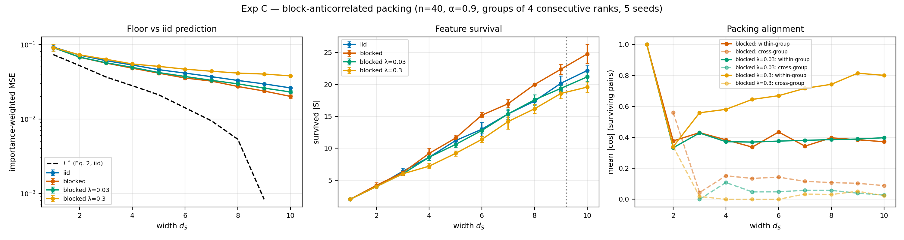

## Importance-slope & threshold robustness (n=200, d=10)

### Packing-law exponent b vs survival threshold

Refit ĝ(α) ∝ g(α)^b at norm² thresholds τ and at C_i thresholds. **The τ-stability claim is scoped to the norm² operationalization**: column norms are strongly bimodal (piled near 0 and near/above 1, with the τ window nearly empty — see fig9_norm_hist_n200.png), which is *why* the exponents are τ-flat. The C_i columns test a different, coarser operationalization and degenerate above C = 0.5 by construction (an antipodal pair already has C = 0.5); they are kept for transparency, not as support. The operationalization's strongest defense is (b′) itself: the kept set it defines yields the best absolute-floor predictions with zero fitted parameters.

| τ | norm² uniform b | norm² Zipf b | C_i uniform b | C_i Zipf b |
|--:|----------------:|-------------:|--------------:|----------:|
| 0.3 | 0.934 | 0.534 | — | -1.842 |
| 0.4 | 0.934 | 0.534 | — | -1.690 |
| 0.5 | 0.934 | 0.534 | — | -1.728 |
| 0.6 | 0.934 | 0.534 | — | -2.352 |
| 0.7 | 0.934 | 0.534 | — | -2.352 |

Across τ ∈ [0.3, 0.7] the norm² exponents stay in uniform [0.93, 0.93], Zipf [0.53, 0.53] — the split is threshold-stable under the norm² operationalization.

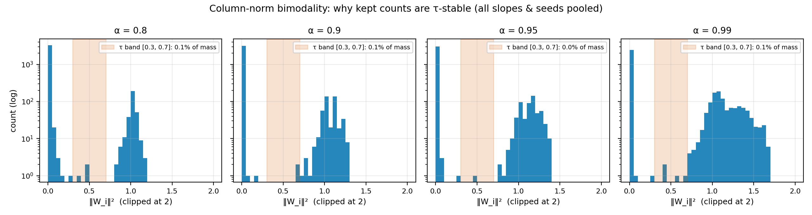

### Capacity scaling vs importance slope ĝ(α, s)

Fit ĝ(α) = a·g(α)^b at τ=0.5 for I ∝ i^(−s); ± values are seed-bootstrap standard errors (B=1000):

| slope s | a ± SE | b ± SE | surv/d @α=0.8 | surv/d @α=0.9 | surv/d @α=0.95 | surv/d @α=0.99 |
|--:|--:|--:|--:|--:|--:|--:|
| 0 | 0.93 ± 0.01 | 0.93 ± 0.01 | 2.47 | 4.00 | 5.70 | 16.13 |
| 0.5 | 1.03 ± 0.03 | 0.69 ± 0.01 | 2.07 | 3.03 | 4.03 | 8.37 |
| 1 | 1.03 ± 0.03 | 0.53 ± 0.01 | 1.83 | 2.33 | 2.83 | 5.30 |
| 1.5 | 0.99 ± 0.03 | 0.44 ± 0.02 | 1.63 | 1.83 | 2.33 | 3.80 |
| 2 | 1.02 ± 0.03 | 0.34 ± 0.01 | 1.43 | 1.77 | 1.97 | 2.87 |
| 3 | 0.82 ± 0.03 | 0.34 ± 0.02 | 0.97 | 1.60 | 1.70 | 2.13 |

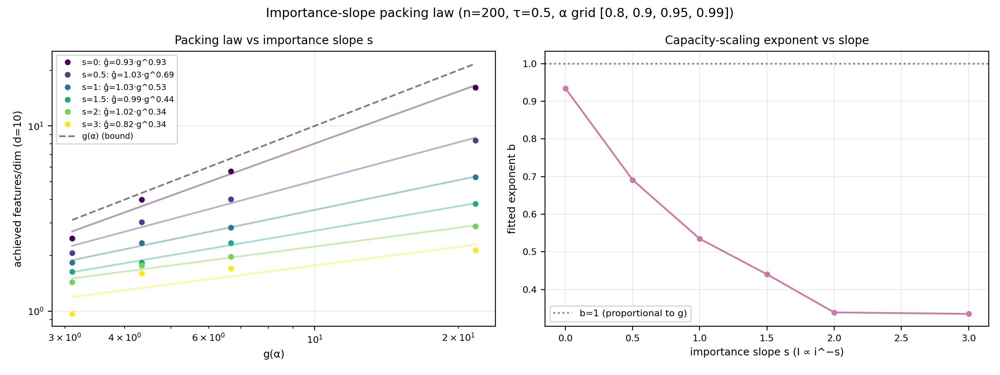

## α=0.99 uniform packing — convergence-limited?

Is the sub-g uniform packing fraction at α=0.99 a real equilibrium or slow symmetry-breaking? n=400 keeps the n/d ceiling non-binding (n/d = 40 > g = 21.7).

| run | n | active/feature | survived/d | fraction of g(α) |
|---|--:|--:|--:|--:|
| n200 baseline (1×) | 200 | 1e+06 | 16.40 | 0.76 |
| n400 (1×) | 400 | 1e+06 | 16.10 | 0.74 |
| n400 (3×) | 400 | 3e+06 | 15.63 | 0.72 |

**Verdict:** at fixed n=400, tripling the training budget changes survived/d by -0.47 (-2.9%). The fraction plateaus — the sub-g packing is a real equilibrium, not an optimization artifact. Relative to the n=200 baseline the n=400 3× value is -4.7% — an n-dependence of the prefactor, listed as a limitation in the README.

## Capacity-bound gap probe (n=200, d=10)

Gap between the capacity bound g(α) and the packing achieved by the trained ReLU decoder, vs importance distribution and sparsity (update-equalized across α).

| α | g(α) | zipf surv/d | uniform surv/d | ΣC_i/d (zipf / uniform) |
|--:|-----:|------------:|---------------:|------------------------:|
| 0.8 | 3.11 | 1.80 | 2.60 | 1.000 / 0.999 |
| 0.9 | 4.34 | 2.27 | 3.90 | 0.999 / 0.999 |
| 0.95 | 6.68 | 2.93 | 5.67 | 0.997 / 1.000 |
| 0.99 | 21.71 | 5.33 | 16.40 | 0.981 / 1.000 |

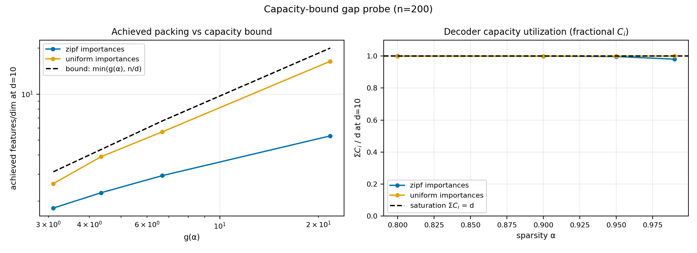
